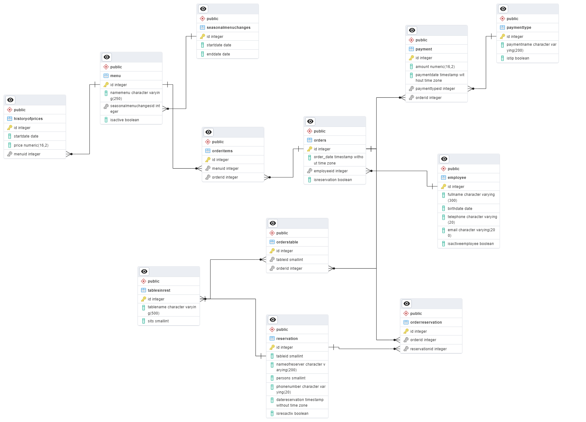
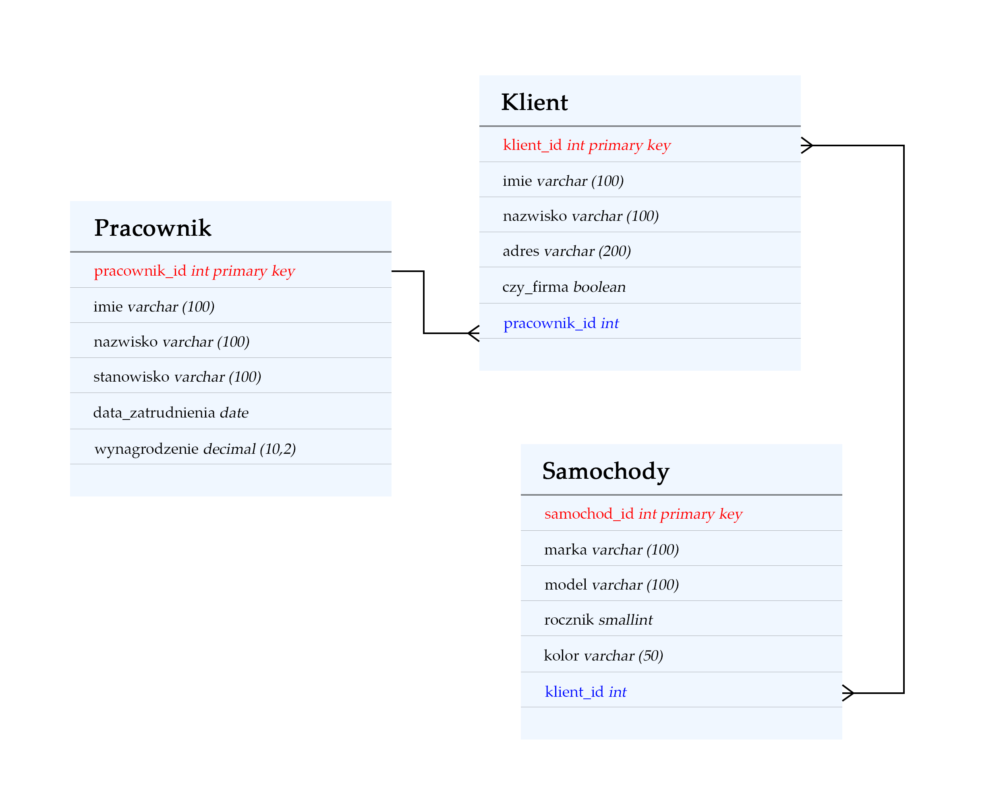

<i>Through my studies, I have gained valuable experience in working with databases using both GUI and CLI. I have successfully completed several projects, including one that utilized PostgreSQL with a user-friendly UI, and another that leveraged the command line for MySQL. This hands-on experience has equipped me with essential skills in database management and development.  </i>

**Skills I’ve got:**
 🔹	create table / delete table
 🔹 	full form of SQL query (select, where, group by, having, order by)
 🔹 functions (min, max, sum, avg, count)
 🔹 	join (inner, left, right, full)
 🔹 	subqueries
 
 

# 1️⃣ Data Base of Cafe

<i>This project is made with PostgreSQL (using pgAdmin4).
My task was to create a Data Base for a business, so chose café and then practiced on it.</i>

### Below you can see the scheme of the DB I made. There are several main modules:
**1)**	orders
 **2)**	menu + seasonalmenuchanges, historyofprices, orderitems
 **3)**	payment + paymenttype
 **4)**	tablesinrest + orderstable
 **5)**	reservation + orderreservation
 **6)**	employee

(1) Table **“orders”** consists of the information about the order, such as who served this order, date of the order and if there is a reservation. (2) This table is connected to the table “menu” through the table **“orderitems”** (like router). Table **“menu”** has data about name of dish, is this dish a temporary or not and is it actual for today. All the prices of our menu are in the table **“historyofprices”**, but action dates of seasonal menu concentrated in the table **“seasonalmenuchanges”** – both connected to the table “menu”. 
 (3) So, when the order is made it’s time to pay. Table **“payment”** has information like sum of check. It also refers to the table **“paymenttype”** which stores types of payments. For example, by cash or card and whether there are tips.
 (4) Table **“tablesinrest”** has information about all the tables that are in restaurant, for example, name of the table, how many sits it has. This table is also connected with the table “orders” by the table **“orderstable”** (also like router) so we may understand what table people sit at in certain order.
 (5) If the order has a reservation, we need to see the table **“reservation”** through the table **“orderreservation”**. “Reservation” has next data: how reserved a table, which one, how many persons are going to be and phone number of the contact person.
 (6) Finally, when we want to know who served the order, we refer to the table **“employee”** where we can find full name of the employee, her/his phone number, birthdate, email address and whether she/he is hired right now.

 

### Here are links to the scripts for the database:
✅ [Create DataBase script](DataBase_Cafe_Create.sql)
 ✅ [Examples of the SQL-requests I do](Scrips.txt)

 

### Scheme:

 

# 2️⃣ Second project
 

<i>As a warm-up, table 'Produkty' was created, serving as the foundation for executing various queries.
Then began a main project. The goal was to create relational database, complete it with 3 structured tables and fulfill them with data. After that I needed to executed some queries.</i>

During this task I strengthened my knowledge in subqueries

### Link to the Script:
✅ <a href='Scripts from Trainee.sql'>Link to the Script</a>
 
 

### Scheme:

## Tips for SQL

 

